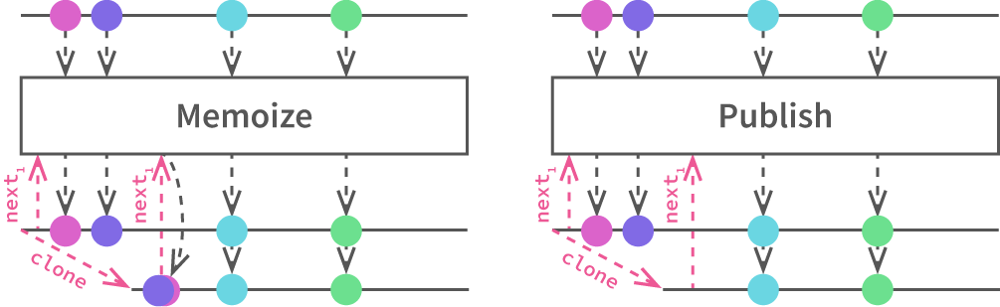
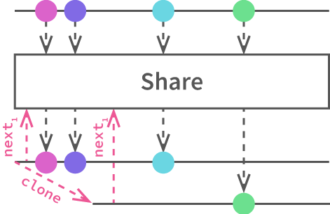

## AmpReactor &mdash; adding some InteractiveX to PHP

```
$ composer require hhreact/ampreactor
```

### Getting started

#### The what

If you know what **InteractiveX** is, AmpReactor matches the InteractiveX philosophy closely, really only [straying significantly for the binding operators](#operators).

If, alternatively, you know what **ReactiveX** is, InteractiveX is the "pull" analogue, where enumerables take the place of observables.

If you know about AmPHP's [`Iterator`](https://docs.hhvm.com/hack/async/generators#sending-and-raising), AmpReactor lets you clone, reduce and expand async `Iterator`s, and lets you enforce precise policies on buffering.

#### In action

```php
<?php
use AmpReactor\InteractiveProducer;

\Amp\Loop::run(function() {
	// Start with any Iterator
	$iter_numbers = \Amp\Producer(function($emit) {
		for($i = 0; ; yield $emit($i++)) {}
	});
	
	// Now make it really P R O D U C E
	$number_producer = InteractiveProducer::create($iter_numbers);
	
	// Transform a stream, e.g. map
	$square_producer = (clone $number_producer)->map(function($root) { return pow($root, 2) });
	// Transform two streams into one, e.g. zip
	$cube_producer = InteractiveProducer::zip($number_producer, $square_producer, function($root, $square) { return $root * $square; });
	// Transform many streams into one, e.g. merge
	$merged_producer = InteractiveProducer::merge(Vector{ $number_producer, $square_producer, $cube_producer });
	while(yield $merged_producer->advance()) {
		// numbers flying at your face! Beware: no guaranteed order with `merge`
		$item = $merged_producer->getCurrent();
		var_dump($item);
		
		// To cancel/dispose, just use what the language gives you: `break`, `return` and `throw`;
		//  the iterating scope is in full control.
		if($item > 42) {
			unset($merged_producer);
			break;
		}
		
		// The "Details of InteractiveProducer" section further down explains what
		//  happens when you cancel an InteractiveProducer partway
	}
	
	// Note that InteractiveProducer wraps transparently:
	$cloned_producer = clone $number_producer;
	while(yield $cloned_producer->advance()) { /* same items as $iter_numbers */ }
	
	// In general, don't try iterate the original Iterator:
	//  you'll probably get a "The prior promise returned must resolve
	//  before invoking this method again" exception
});
```

#### The context (the sales pitch)

This library is something of a language port of [HHReactor](https://github.com/acrylic-origami/HHReactor), the original implementation of this functionality which was written in [Hacklang](http://hacklang.org/). In replacement of Hacklang's built-in async, this library builds on the [Amp concurrency framework](http://amphp.org/amp/).

Amp allows one to write asynchronous code without callbacks in PHP by carefully controlling generators and interfacing between these generators and PHP event loop extensions. This way, async and sync code can blend seamlessly, and in similar spirit to Hack async, a lot of idioms from the language itself are preserved for async behavior. 

By itself, Amp's `Producer` already:

1. Manages backpressure with a queue built out of an array,
2. Allows merging and collapsing of higher-order iterators by emitting to a common output
3. Lets code "await" promises by yielding them

Foremost, AmpReactor diversifies the backpressure options to match those in InteractiveX: `Share`, `Memoize` and `Publish` ([described later](#dynamics)). This way, iterators are no longer limited to one consumer at a time.

Many consumers potentially means many useful forms of the same iterator, so built into AmpReactor are almost all of the [ReactiveX/InteractiveX operators](http://reactivex.io/documentation/operators).

### AmpReactor: what's in the box

- **`BaseProducer`**: manages cloning and accounting on running clones
- **`InteractiveProducer extends BaseProducer`**: InteractiveX operators and support for [arbitrary scheduling and higher-order iterators](#constructor). The &#x2B50; of the show

### <a name="operators"></a>Operators

Most of the operators match the canonical InteractiveX/ReactiveX signatures. The quickest way to scan the signatures is to [look at the reference documentation](#ref-doc).

Major discrepancies:

1. **"Binding" operators &ndash; `share`, `memoize`, `publish`**: [these are replaced by cloning](#dynamics).
2. **`defer` operator**: no strong motivation to implement it.

### <a name="dynamics"></a> Dynamics of `InteractiveProducer`

If two or more scopes consume the same stream, they can either clone or not clone the `InteractiveProducer`:

1. **[Ix's Memoize &amp; Publish] If the `InteractiveProducer` is cloned**, the buffer is also cloned, so consumers will receive the same elements from the moment of cloning. In this way, clones act like InteractiveX's `Memoize` and ReactiveX's [`Replay`](http://reactivex.io/documentation/operators/replay.html).

  

  To emphasize: the clone doesn't see any elements produced by that `InteractiveProducer` before the clone exists. In this way, `Memoize` and `Publish` behavior differ only in when/of what the consumer takes a clone. Cloning from a `InteractiveProducer` that is never iterated will give `Memoize` behavior. Cloning moving `InteractiveProducer`s will give `Publish` behavior.
  
  Note however that, because the consumer is in control of iteration, the underlying iterators aren't started until the first clone requests the first element.

  > **Behavioral Note**: as [will be mentioned below too](#buffering), the buffer is managed like `Publish` rather than `Memoize`. `InteractiveProducer` is very straightforward with deciding which nodes are reclaimed because it relies on the garbage collector: once the laggiest consumer advances, the node is reclaimed. It is then a simple and explicit matter of keeping or not keeping unstarted `InteractiveProducer`s, which will or won't hold elements from the very beginning respectively.
2. **[Ix's Share] If the `InteractiveProducer` is not cloned**, consumers all share the same buffer, and hence they compete directly for values.

  

> **Behavioral note**: All operators implicitly clone their operands to avoid competing with other operators or raw consumers for values; they all implicitly `Publish`.

<!-- ### <a name="ref-doc"></a>Reference Documentation

[hphpdoc](https://github.com/appertly/hphpdoc) makes reference documentation really easy to compile as needed:

```bash
$ mkdir doc
$ ./vendor/appertly/hphpdoc/bin/hphpdoc -o doc -- src
$ # View in browser at ./doc/index.html
```

-->

---

### Details of `InteractiveProducer`

#### <a name="buffering"></a> Details of buffering

The producing and consuming timelines are separated by a buffer, and if not paused, the underlying iterators don't wait for consumption. That is, once started, they will run and push to the buffer even in the absence of a matching stream of `advance` calls. As a result, iterators can run as quickly as possible, and memory can be controlled by managing references and sharing behaviors.

Generally, `InteractiveProducer` relies on the garbage collector to clear the buffer it accumulates from differences in consumption rates between consumers. As the laggiest consumers step their way through the buffer, their references to the earliest nodes of the buffer linked list are shed and the garbage collector clears these unreachable nodes.

#### Running, pausing and exiting early

**The how**

You can stop consuming from a `InteractiveProducer` in a few ways, each with different consequences for resources.

1. _Just drop all references to it_, and free resources as quickly as possible. This includes all clones and all `InteractiveProducer`s that come from operations on the `InteractiveProducer` of interest.
2. _Drop only the running instances/clones_, and stop consuming resources quickly, but maybe restart later.

**The why**

When disposing of `InteractiveProducer`s, there are two determining factors to the iterators and buffers in their ecosystem after they become unreachable:

1. Has `next` ever been called on it, its clones, or `InteractiveProducer`s coming from its operators?
2. What do they wrap? 
	- Other `InteractiveProducer`s (e.g. are they results of operators on other `InteractiveProducer`s)?
	- `AsyncGenerator`s?
	- (Notably, what happens to an opened TCP stream?)

`InteractiveProducer` is designed with pausing in mind, to meet the need to arbitrarily stop buffering values but keep resources open to resume later. Some informative aspects of the process:

1. When the first item is requested from a `InteractiveProducer`, it begins "running".
2. Each `InteractiveProducer` knows the number of running clones.
3. `detach`ing a running `InteractiveProducer` decrements the running count.
4. When the running count drops back to 0, the `InteractiveProducer`:
	1. Stops running its children (so the buffer stops growing) and
	2. "detaches" from its child `InteractiveProducer`s by decrementing their running refcounts.\*

See 1. `InteractiveProducer::_attach()`; 2. `BaseProducer::running_count`, `BaseProducer::this_running`, `BaseProducer::some_running`; 3. `InteractiveProducer::_detach`; 4.1. `InteractiveProducer::iterator_to_emitting_generator`; 4.2. `InteractiveProducer::_detach`.

<sup>\*A `InteractiveProducer` knows it holds running references to all of its children because, as part of its attachment routine, `InteractiveProducer` must start iterating them all.</sup>
